<div align="center">

  <h1 align="center">AWS Secure Banking Platform & AI Risk Engine</h1>
  <p align="center"><b>Enterprise-Grade Cloud Architecture, Automated Infrastructure & Real-Time Threat Mitigation</b></p>

  <p>
    
    
    
    
    
  </p>
</div>

---

##  System Architecture Overview
The core infrastructure blueprint of the secure banking platform, enforcing strict perimeter defense, multi-AZ isolation, and automated serverless telemetry.

<p align="center">
  
</p>

---

##  Real-Time Threat Detection & Automated SNS Notification
The system automatically detects suspicious behavioral patterns (such as unrecognized devices or unusual login timings), computes a risk score, and dispatches instant security alerts via **AWS SNS** directly to administrators[cite: 5]:

<p align="center">
  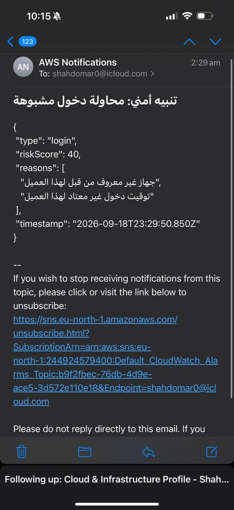
</p>

---

##  Technology Stack & Core Modules

| Component Tier | AWS & Tech Services | Implementation Purpose |
| :--- | :--- | :--- |
| **Edge & Security** | CloudFront, AWS WAF, Shield, Cognito | SSL termination, DDoS/SQLi mitigation, and MFA user authentication. |
| **Networking** | Custom VPC, Public/Private Subnets, NAT | Multi-AZ isolation separating public entry points from internal data layers. |
| **Compute & Backend** | ECS, Fargate, ECR, Docker | Containerized microservices running secure banking backend operations. |
| **Database Tier** | Amazon RDS (PostgreSQL) | Fully encrypted relational database instances hosted in isolated private subnets. |
| **SecOps & AI** | GuardDuty, Macie, Inspector, Lambda | Real-time threat detection, automated event tracing, and instant SNS alerting. |
| **Automation** | Terraform (IaC) | Declarative provisioning and state management across all cloud environments. |

---

## 📐 Infrastructure & Security Visual Blueprint

<details>
<summary><b>📂 Click to expand and view technical implementation snapshots</b></summary>

### 1. Networking & Perimeter Control
* **VPC & Load Balancing:**
  <p>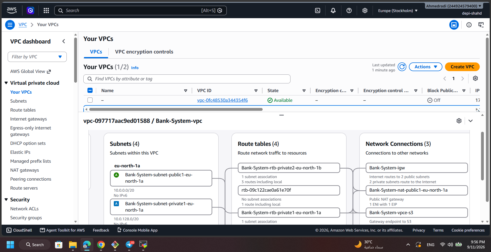 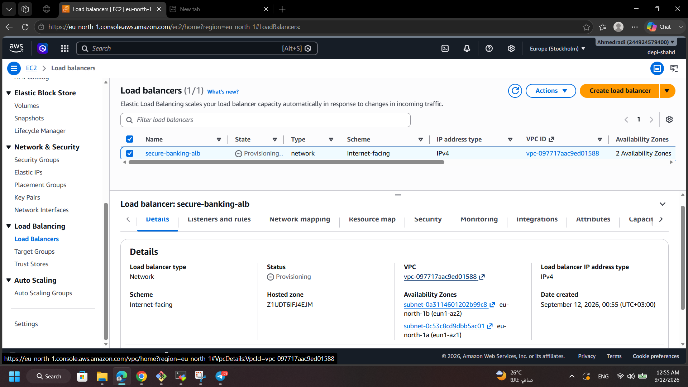</p>
* **Security Groups & IAM Policies:**
  <p>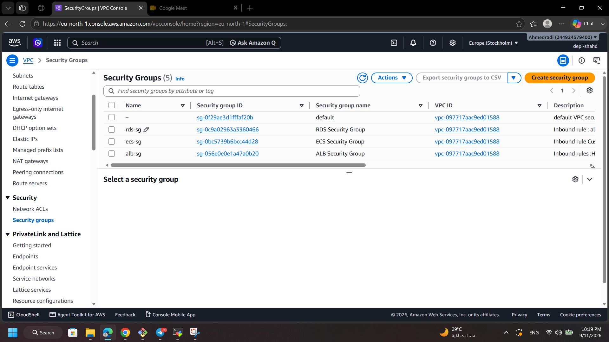 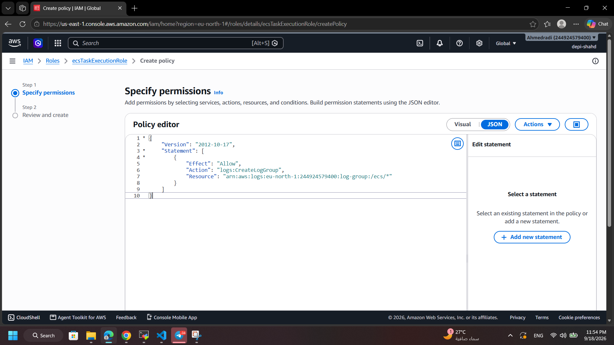</p>

### 2. Compute, Registry & Database
* **Containers & ECR:**
  <p>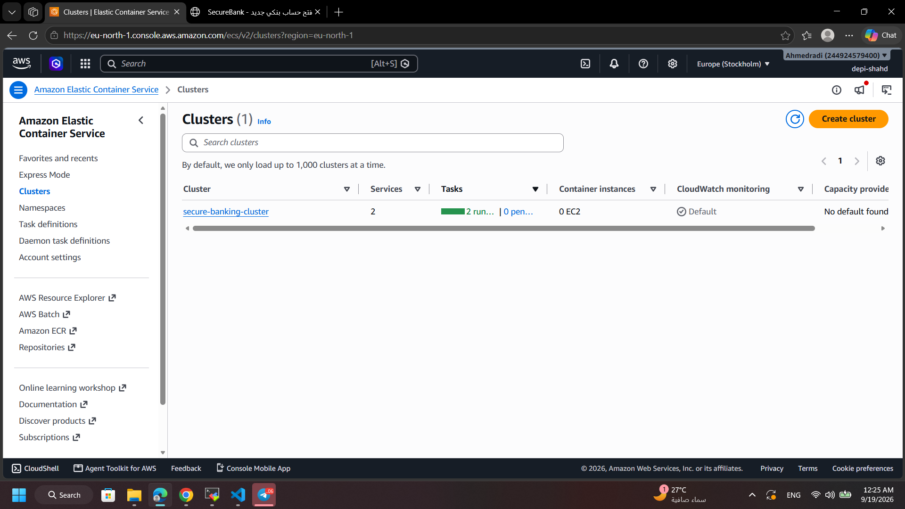 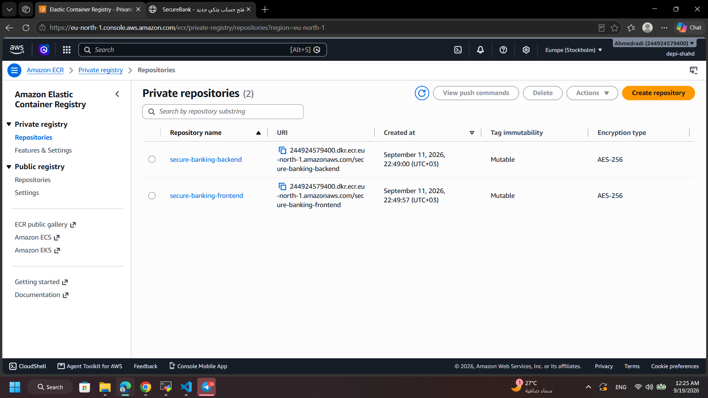</p>
* **Database & Storage:**
  <p>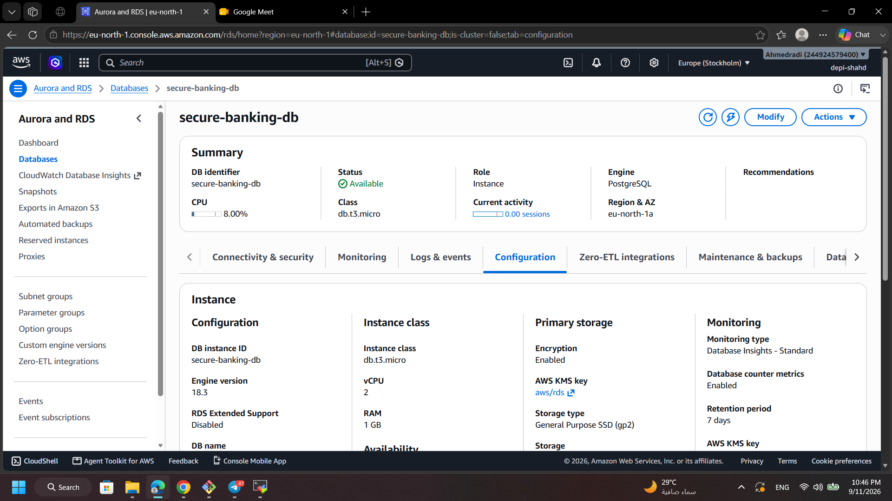 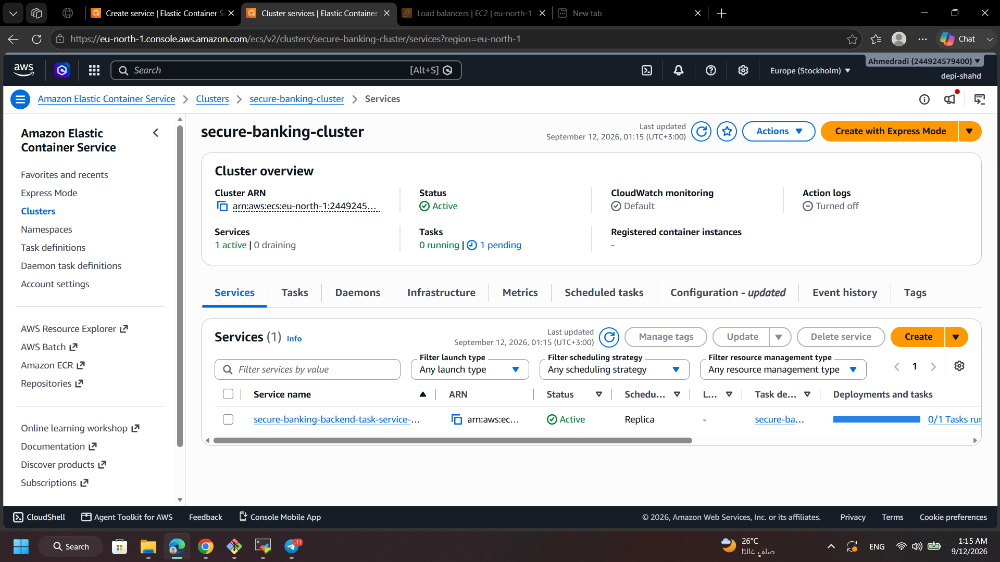</p>

### 3. Serverless, Logging & Threat Monitoring
* **AWS Lambda & Deployment:**
  <p>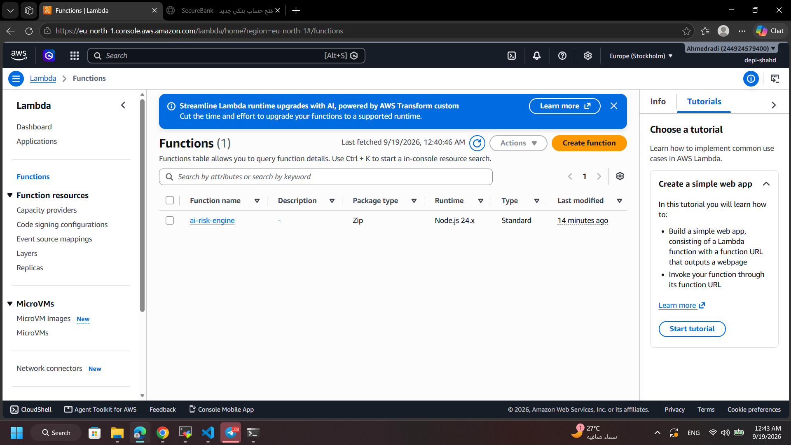 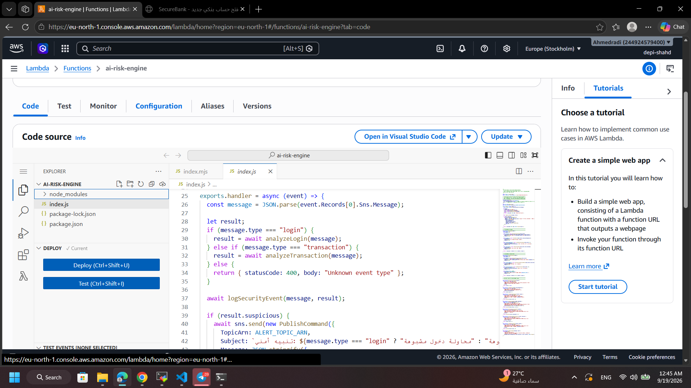</p>
* **CloudWatch Alarms & SNS Auditing:**
  <p>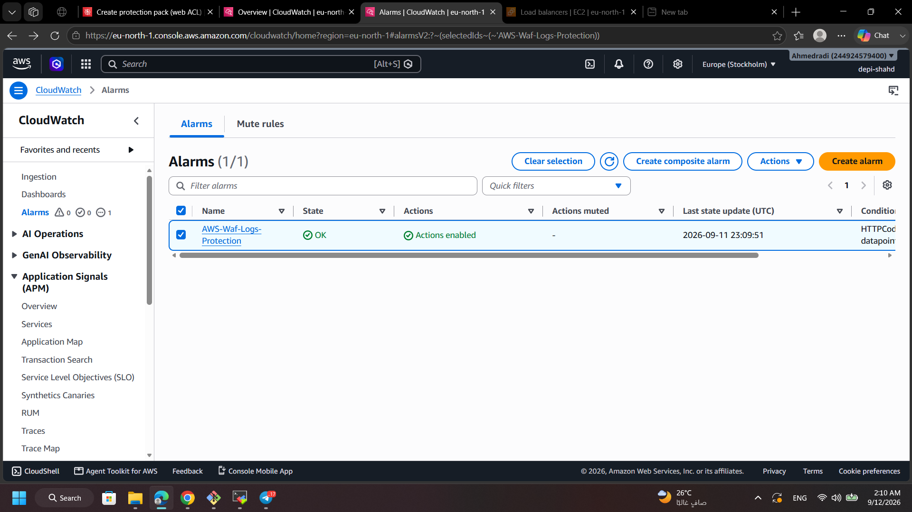 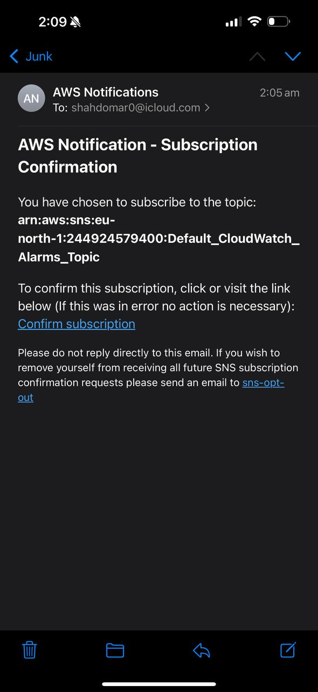</p>

</details>

---

##  Quick Start & Deployment Guide

To provision the infrastructure locally via Terraform:

```bash
# 1. Clone the repository
git clone [https://github.com/shahdomar898/AWS-Bank-System.git](https://github.com/shahdomar898/AWS-Bank-System.git)
cd AWS-Bank-System/terraform

# 2. Initialize Terraform workspace
terraform init

# 3. Preview execution plan
terraform plan

# 4. Apply configuration to AWS
terraform apply  
