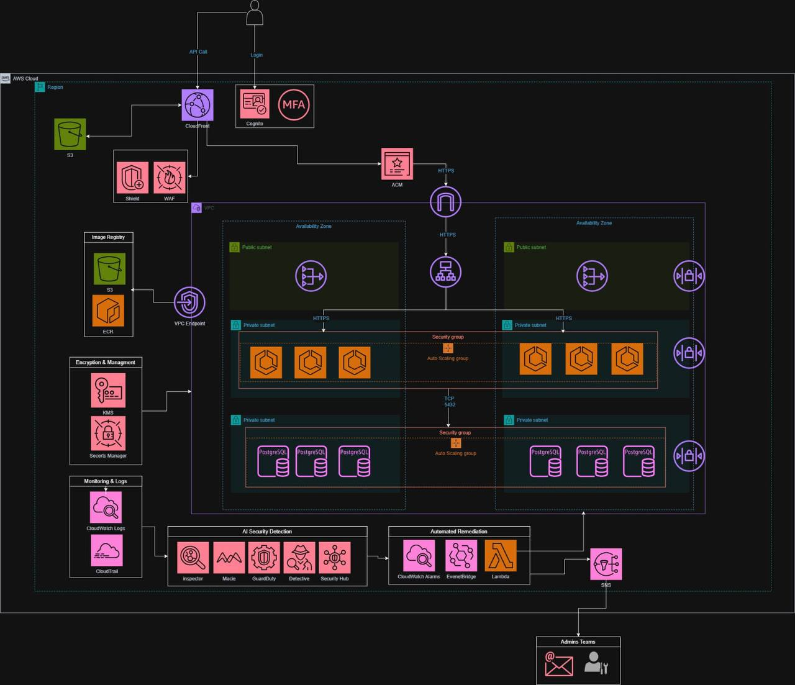

<div align="center">

  <h1 align="center">🛡️ Enterprise Secure Cloud-Native Banking Platform & AI Risk Engine</h1>
  <p align="center"><b>A Zero-Trust, Highly Available, Multi-AZ Financial Ecosystem with Automated SecOps & Real-Time Threat Mitigation</b></p>

  <p>
    
    
    
    
    
  </p>
</div>

---

##  Core Architecture Blueprint
The high-level enterprise blueprint of the secure banking infrastructure, enforcing strict perimeter isolation, multi-AZ deployment, and integrated AI security layers:

<p align="center">
  
</p>

---

## 🔄 System Data Flow
```mermaid
graph TD
    User([Client / User Browser]) -->|HTTPS / API Requests| CF[CloudFront Edge Locations]
    CF --> WAF[AWS WAF & Shield Perimeter]
    WAF --> ALB[Application Load Balancer]
    ALB -->|Public Subnet Entry| ECS[ECS Fargate - Containerized App Tier]
    ECS -->|Encrypted Connection Port 5432| RDS[(PostgreSQL Encrypted DB in Private Subnet)]
    
    subgraph AI Security & Automated Remediation Stack
        ECS -->|Behavioral Telemetry Logs| CW[CloudWatch Alarms & Metrics]
        CW -->|Trigger Anomaly Event| Lambda[AWS Lambda Automated Remediation]
        Lambda -->|Instant Security Payload| SNS[Amazon SNS Notification Topic]
        SNS -->|Email / SMS Alert| SecOps[SecOps Admin Team]
    end
